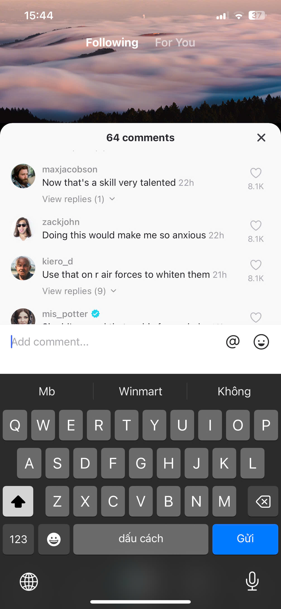

# TikTok UI Exam

## Thông tin sinh viên
- Họ tên: Đỗ Thanh Hiếu  
- MSSV: 23810310380  
- Lớp: D18CNPM5  

---

## Mô tả bài làm
Project mô phỏng giao diện TikTok với 3 màn hình chính:
- Following  
- For You  
- Comments  


## Điều hướng (Navigation)

- Top Tabs Navigator:
  - Following
  - For You  

- Bottom Tabs Navigator:
  - Home
  - Comments  

---

## Chức năng màn hình Comments

Màn hình Comments được xây dựng gần với trải nghiệm thực tế:

- Mở khi nhấn icon comment ở cụm action bên phải video  
- Giữ lại background video phía sau  
- Hiển thị panel comments từ dưới lên  
- Hiển thị danh sách comment gồm:
  - Avatar
  - Tên người dùng
  - Thời gian
  - Số lượt thích  

- Cho phép:
  - Like / Unlike từng comment  
  - Mở / đóng replies  
  - Nhập và gửi comment trong ô `Add comment...`  

- Tự động cập nhật số lượng comment sau khi thêm mới  
- Đóng panel và quay về đúng màn hình trước đó  

---

## Hướng dẫn chạy project

### 1. Cài dependencies
```bash
npm install
```

### 2. Chạy Expo
```bash
npx expo start
```

### 3. Mở app
Mở ứng dụng bằng:
- Expo Go (trên điện thoại)
- Android Emulator / iOS Simulator

---


## Ảnh chụp màn hình

### Home (Following)


### Home (For You)


### Comments


